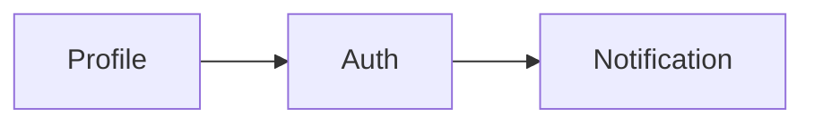

# internship
# Архитектура

Все сервисы будут работать в разных Docker-контейнерах.
Их публичное API будет предоставляться через ?????????.
Межсервисное взаимодействие будет осуществляться через Apache Kafka.

### Схема микросервисов

**Note:** Некоторые транзитивные зависимости были неучтены или забыты

### Описание микросервисов

| Название                       | Описание                                                                                                                                                 |
| ------------------------------ |----------------------------------------------------------------------------------------------------------------------------------------------------------|
| [Auth](auth.md)                | Сервис авторизации и аутентификации пользователей. Включает в себя регистрацию/вход и выпуск JWT-токенов.                                                |
| [Profile](profile.md)          | Сервис профилей пользователей.                                                                                                                           |
| Notification                   | Сервис для отправки уведомлений. Используется для отправки писем с кодами подтверждения(?) (просто ссылкой, по которой ну;но перейти для подтверждения). |       

Project: Gradle или Maven (лучше Gradle)
Language: Java
Spring Boot: 3.3.0
Java: 22
Dependencies:
Lombok
Spring Web
Spring Configuration Processor 
Spring Boot DevTools
Spring Data PostgreSQL
Validation