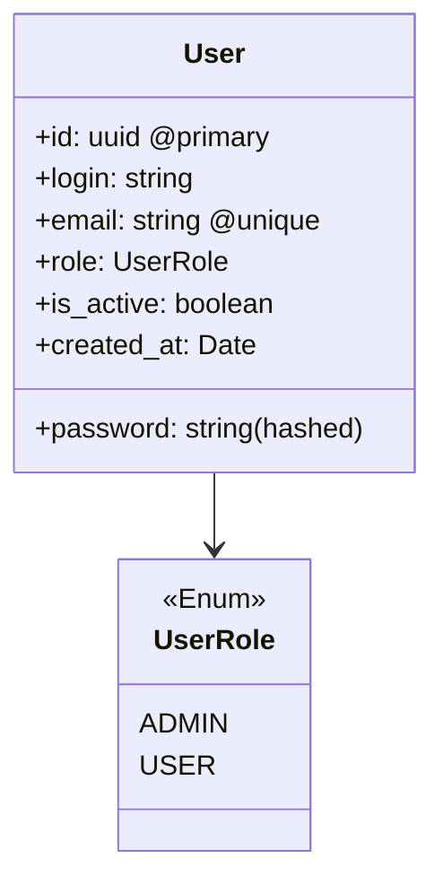

# Сервис аутентификации

Сервис аутентификации предназначен для управления пользователями и их аутентификации.

JWT-токены должны быть подписаны приватным ключом, который хранится только у Auth. Остальные сервисы хранят публичный ключ и используют его для проверки подписи.

## Сущности



Полезная нагрузка JWT-токена:

```json
{
  "uuid": 1,
  "role": "ADMIN",
  "exp": 1610000000
}
```
